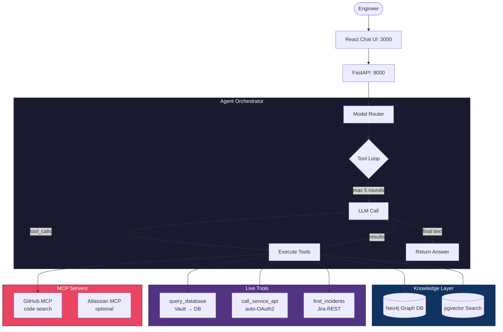
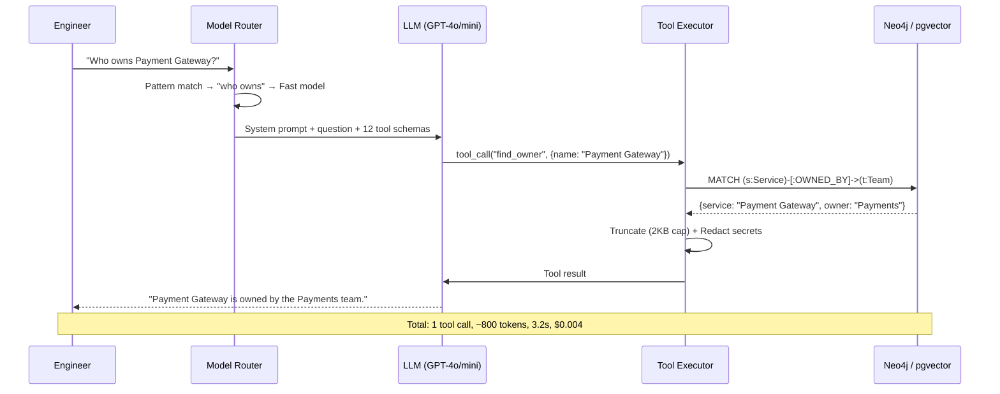
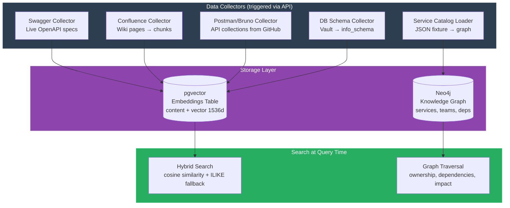

# Nexus AI — Enterprise Intelligence Agent

**Ask your microservice platform anything.** A single chat interface where engineers ask natural language questions about services, APIs, databases, dependencies, and documentation — and get reasoned, evidence-backed answers in seconds.

```
> "Who owns the payment gateway?"
→ Payments team (instant graph lookup, 3s, ~$0.005)

> "What's the impact of removing /refunds from Payment Gateway?"
→ 3 consumers affected (Order Service, API Gateway, Reporting Service). Risk: HIGH.

> "Show me the latest 5 orders"
→ [live DB query via Vault dynamic credentials]

> "Any recent bugs with Search Service?"
→ [live Jira query, returns 4 tickets]
```

---

## Why This Exists

In a 10–50 microservice platform, engineers waste hours answering questions like:
- "Who owns this service?" → Slack someone, wait 2 hours
- "What calls this endpoint?" → Grep across 30 repos, read Swagger specs
- "What table stores X?" → Ask DBA, check schema wiki (outdated)
- "Is it safe to deprecate this?" → Tribal knowledge, meetings

**Nexus AI** replaces all of that with a single agent that has access to a knowledge graph, semantic search, live databases, live APIs, and issue trackers — and reasons across all of them.

---

## Architecture



### Model Routing Strategy

```mermaid
graph LR
    Q[User Question] --> Check{Pattern Match}
    Check -->|"who owns..."<br/>"list services..."| Fast[GPT-4o-mini<br/>~$0.005/query]
    Check -->|"impact of..."<br/>"query database..."| Smart[GPT-4o<br/>~$0.03/query]
    Fast --> Answer[Answer]
    Smart --> Answer

    style Fast fill:#2ecc71,stroke:#27ae60,color:#fff
    style Smart fill:#e74c3c,stroke:#c0392b,color:#fff
```

---

## Key Design Decisions

| Decision | Why |
|----------|-----|
| **Model routing** (fast/smart) | Simple ownership lookups use GPT-4o-mini (~$0.005), complex analysis uses GPT-4o (~$0.03). Saves ~80% on token costs. |
| **Meta-tool pattern** for MCP | Instead of injecting all 40+ MCP tool schemas (~15K tokens/request), one meta-tool routes to any MCP tool by name. Saves $2-5/day at scale. |
| **Tool result truncation** (2KB cap) | Prevents token budget blow-ups from large API responses or DB results. Smart truncation preserves first N items. |
| **3-layer secret redaction** | Scrubs API keys, tokens, and passwords from: (1) tool results before LLM sees them, (2) logs, (3) final user-facing answer. |
| **Hybrid search** (vector + text) | Semantic embeddings for concept matching ("payment flow" finds "amortization_schedule"), with text ILIKE fallback for exact matches. |
| **Vault dynamic credentials** | Never stores DB passwords. Gets short-lived credentials per query, enforces read-only at transaction level. |
| **Token budget cap** (30K/query) | Hard stop prevents runaway agent loops from burning $50 on a single question. |

---

## How a Query Works (Agent Loop)



---

## Data Pipeline (Pre-indexing)



---

## Performance & Cost

| Metric | Value |
|--------|-------|
| Simple query (ownership, listing) | **~3s**, ~800 tokens, **~$0.005** |
| Complex query (impact, multi-tool) | **~8s**, ~4K tokens, **~$0.03** |
| Live DB query (via Vault) | **~5s** (incl. credential fetch) |
| Model routing savings | **~80%** cost reduction on simple queries |
| Meta-tool token savings | **~15K tokens/request** (vs injecting all MCP schemas) |
| Prompt caching hit rate | **~90%** (system prompt reused across rounds) |
| Max budget per query | 30K tokens / 5 tool rounds (hard cap) |

---

## Tradeoffs & Alternatives Considered

| Decision | Alternative | Why I chose this |
|----------|-------------|-----------------|
| **Neo4j** for service graph | PostgreSQL with recursive CTEs | Graph queries (3-hop dependency tracing) are O(1) in Neo4j vs O(n³) in SQL. Trade: extra infra. |
| **pgvector** for embeddings | Pinecone / Weaviate | Co-located with interaction logs, no external dependency, free. Trade: less scalable past ~100K chunks. |
| **OpenAI-compatible API** | Direct Anthropic/Bedrock SDK | Single interface works with OpenAI, LiteLLM, Ollama, vLLM. Swap providers without code changes. |
| **Meta-tool pattern** for MCP | Send all tool schemas to LLM | 40+ schemas = 15K tokens/request = $5/day burned on schema injection alone. Meta-tool: 500 tokens. |
| **Vault dynamic creds** | Static DB passwords in .env | Short-lived creds (auto-expire), audit trail, no secret rotation needed. Trade: Vault dependency. |
| **Tool result truncation** | Send full results to LLM | One 50-row DB result = 10K tokens. Truncate to 2KB = LLM sees enough to answer, stays in budget. |
| **Hybrid search** (vector + text) | Vector-only | Exact matches ("Config Service") fail with pure semantic search. Text fallback catches them. Trade: two code paths. |
| **Model routing** | Always use best model | 70% of queries are simple lookups. GPT-4o-mini handles them perfectly at 1/10th the cost. |

---

## Quick Start

### Prerequisites

- **Docker Desktop** (Docker + Docker Compose)
- **An OpenAI API key** (or LiteLLM proxy, or Ollama for local LLMs)

### 1. Clone and configure

```bash
git clone https://github.com/srikanthanugu892/nexus-ai.git
cd nexus-ai

# Copy env template and add your API key
cp .env.example .env
# Edit .env — at minimum, set LITELLM_API_KEY
```

### 2. Start everything

```bash
docker compose up --build -d

# Wait ~30s for services to initialize
curl http://localhost:8000/health
# → {"status": "ok", "neo4j": "connected", "pgvector": "connected"}
```

### 3. Seed sample data

```bash
# Load 12 sample microservices into the knowledge graph
curl -X POST http://localhost:8000/admin/collectors/run-all

# Generate embeddings for semantic search (~30s, ~$0.02 one-time)
curl -X POST http://localhost:8000/admin/embeddings/backfill
```

### 4. Open the chat UI

```bash
open http://localhost:3000
```

Try asking:
- "Who owns the Order Service?"
- "What services does the Payments team own?"
- "What's the impact of removing the Inventory Service?"
- "Search for authentication endpoints"

---

## LLM Backend Options

| Provider | Config | Cost |
|----------|--------|------|
| **OpenAI** (default) | `LITELLM_ENDPOINT=https://api.openai.com/v1` | ~$0.005–$0.03/query |
| **LiteLLM proxy** | `LITELLM_ENDPOINT=http://localhost:4000` | Routes to Bedrock/Azure/etc |
| **Ollama** (local, free) | `LITELLM_ENDPOINT=http://localhost:11434/v1` | Free, requires GPU |

---

## Tools Available to the Agent

| Tool | What it does | Data source |
|------|-------------|-------------|
| `find_service` | Fuzzy service lookup with details | Neo4j graph |
| `find_owner` | Service → team ownership | Neo4j graph |
| `list_team_services` | All services owned by a team | Neo4j graph |
| `find_api_consumers` | Upstream dependency tracing | Neo4j graph |
| `search_documentation` | Semantic + text search over all indexed docs | pgvector |
| `call_service_api` | Live API calls with auto-OAuth2 | HTTP + Vault |
| `query_database` | Read-only SQL via Vault dynamic creds | PostgreSQL + Vault |
| `find_database_info` | Schema search across all databases | pgvector |
| `find_incidents` | Recent bugs/incidents for a service | Jira REST API |
| `search_jira` | Keyword search across tickets | Jira REST API |
| `calculate_impact` | Change risk assessment with consumer tracing | Neo4j graph |
| `call_mcp_tool` | Meta-tool routing to any MCP server | MCP protocol |

---

## Data Collectors (Pre-indexing Pipeline)

Collectors ingest data from your infrastructure and make it searchable:

```bash
# Run all collectors
curl -X POST localhost:8000/admin/collectors/run-all

# Or run individually:
curl -X POST localhost:8000/admin/collectors/swagger/run       # API specs
curl -X POST localhost:8000/admin/collectors/confluence/run     # Wiki docs
curl -X POST localhost:8000/admin/collectors/postman_bruno/run  # API collections
curl -X POST localhost:8000/admin/collectors/db_schema/run      # DB schemas (needs Vault)
curl -X POST localhost:8000/admin/collectors/service_catalog/run # Service graph
```

---

## Project Structure

```
nexus-ai/
├── src/nexus_ai/
│   ├── main.py              # FastAPI app entry point
│   ├── config.py            # Pydantic settings from .env
│   ├── agent/               # LLM orchestrator, redaction, logging
│   ├── api/                 # REST endpoints (chat, health, admin)
│   ├── tools/               # 11 agent tools (graph, search, DB, API, Jira)
│   ├── collectors/          # Data ingestion (Swagger, Postman, Confluence, DB)
│   ├── db/                  # Neo4j + PostgreSQL connection management
│   └── mcp_client/          # MCP server lifecycle manager
├── frontend/                # React + Tailwind chat UI
├── data/                    # Service catalog, MCP config, swagger sources
├── migrations/              # SQL schema for pgvector + interaction logs
├── docker-compose.yml       # Full stack (app + Neo4j + PostgreSQL)
├── Dockerfile               # Backend container
└── .env.example             # Configuration template
```

---

## Security Model

| Layer | Protection |
|-------|-----------|
| **Network** | Neo4j + Postgres bound to 127.0.0.1 only |
| **Secrets** | Vault dynamic creds (never stored), 3-layer output redaction |
| **SQL injection** | Only SELECT allowed, keyword blocklist, auto LIMIT 50 |
| **API access** | Host allowlist (only configured internal services callable) |
| **LLM safety** | System prompt hardened against injection, tool results treated as untrusted |
| **Sensitive columns** | password/token/secret columns auto-redacted from DB query results |

---

## Extending

### Add a new tool

1. Create `src/nexus_ai/tools/my_tool.py` with an `async def my_tool(...)` function
2. Register in `src/nexus_ai/tools/registry.py` (add to `TOOL_IMPLEMENTATIONS` + `TOOL_DEFINITIONS`)
3. The agent will automatically discover and use it

### Add a new MCP server

Edit `data/mcp.json` — supports stdio (Docker/npx/uvx) and streamable HTTP transports.

### Add a new collector

Create `src/nexus_ai/collectors/my_collector.py`, register its endpoint in `src/nexus_ai/api/admin.py`.

---

## Development (without Docker)

```bash
python -m venv .venv && source .venv/bin/activate
pip install -e ".[dev]"

# Start Neo4j + Postgres only:
docker compose up neo4j postgres -d

# Run app locally:
uvicorn nexus_ai.main:app --reload --port 8000

# Run tests:
pytest

# Lint:
ruff check src/
```

---

## License

MIT — see [LICENSE](./LICENSE).
